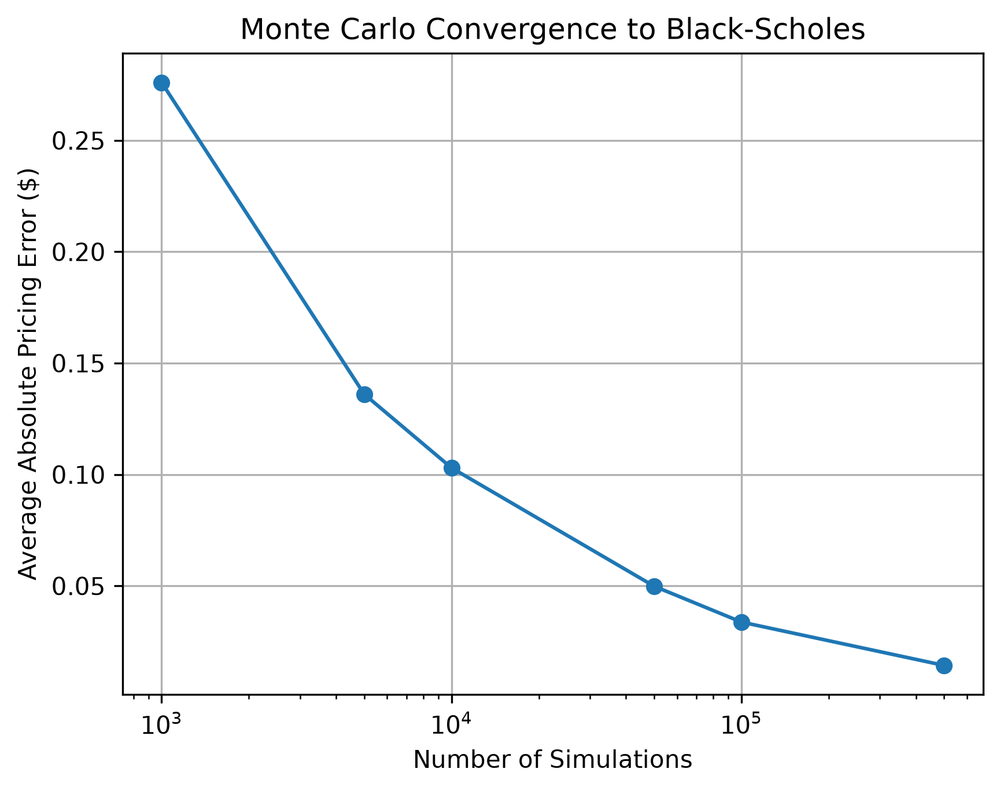
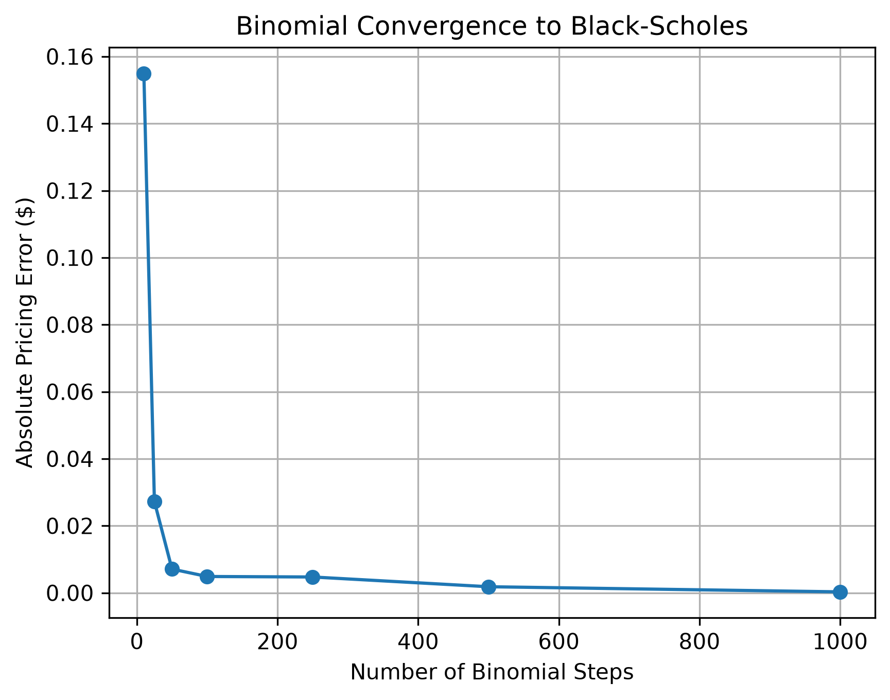
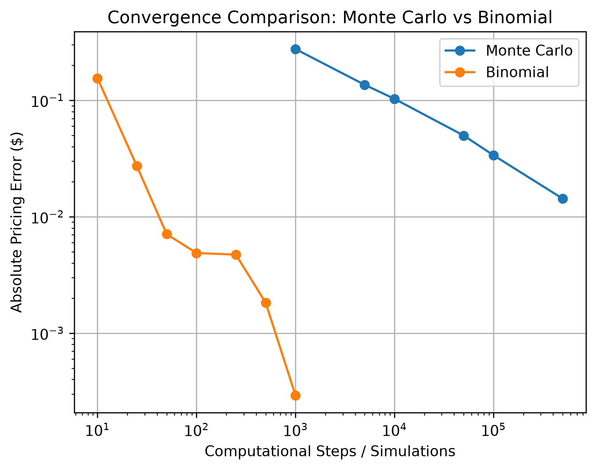
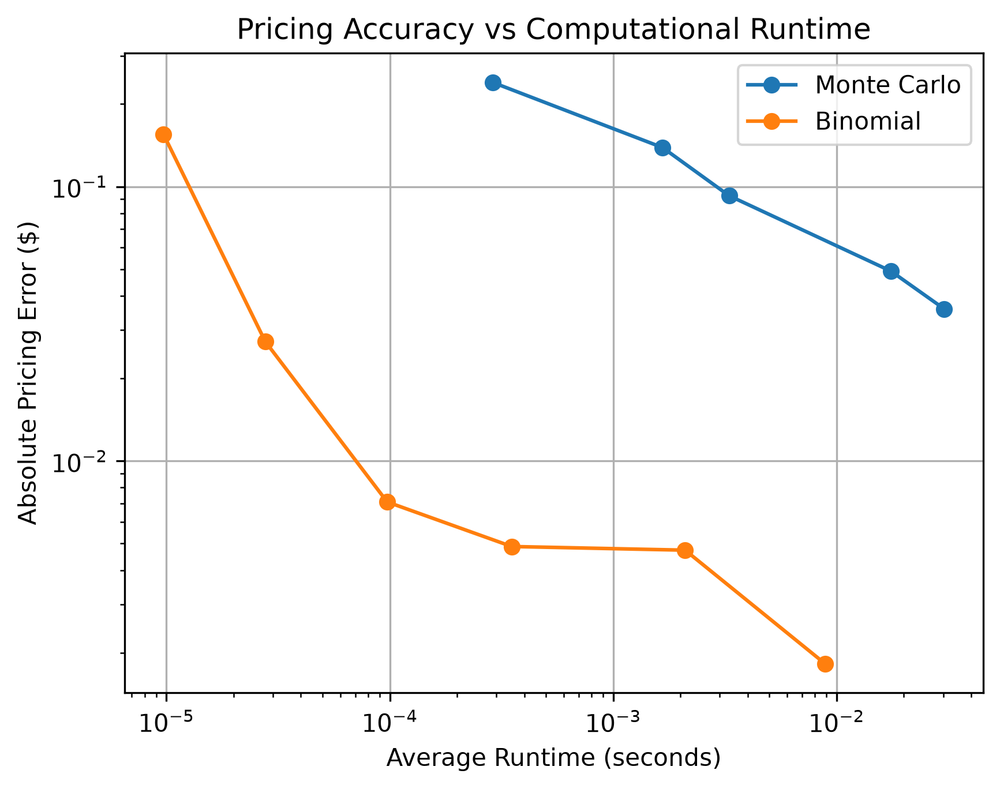
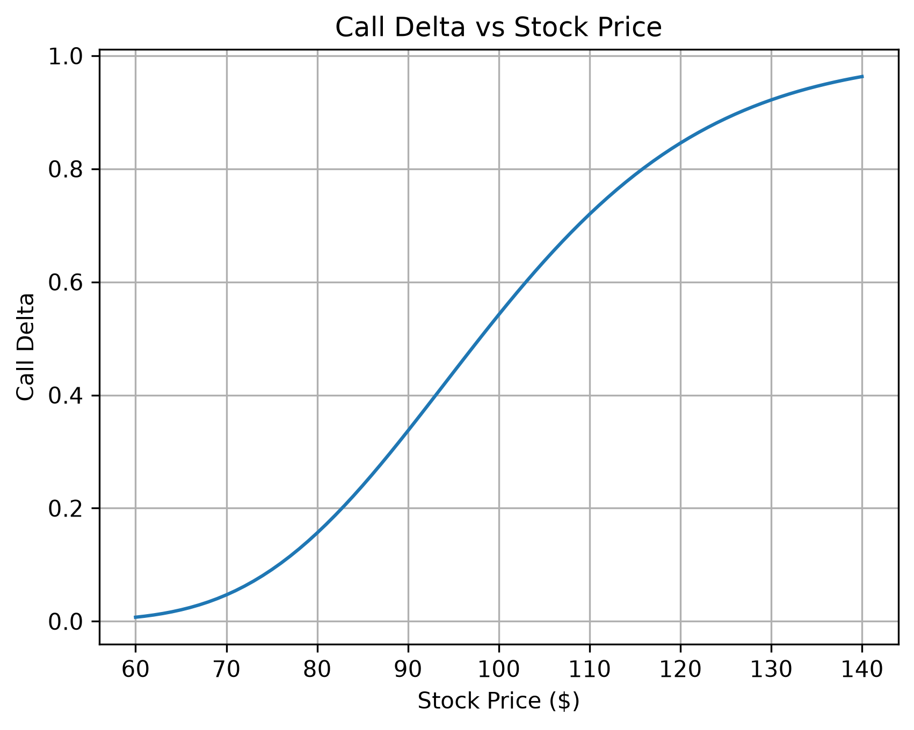
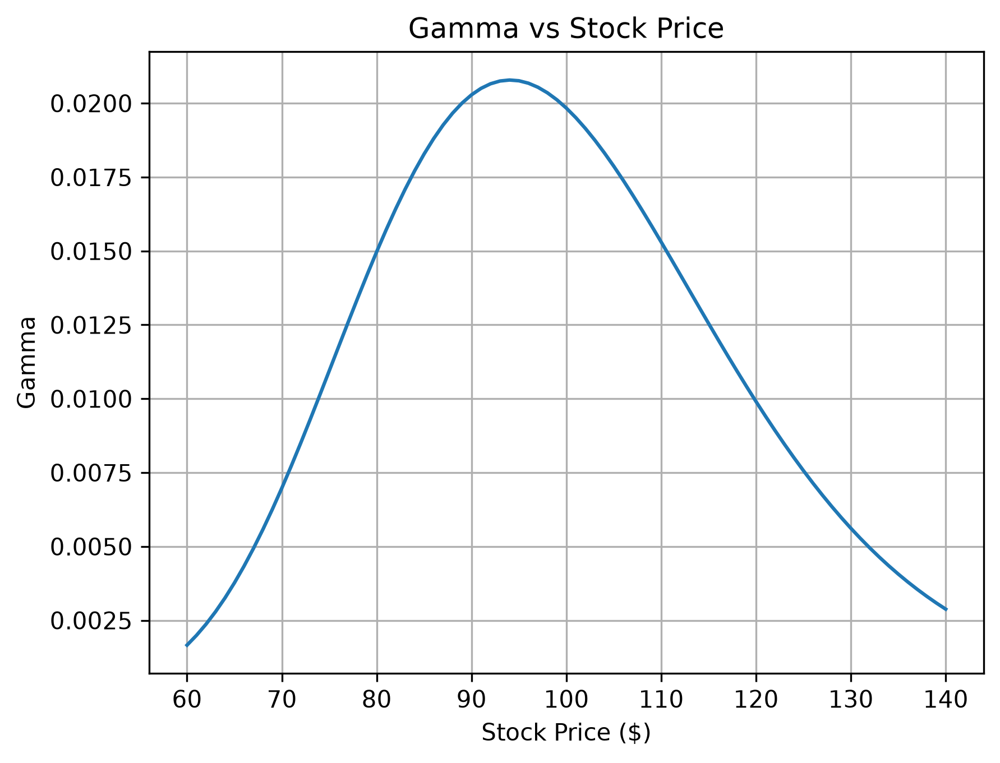
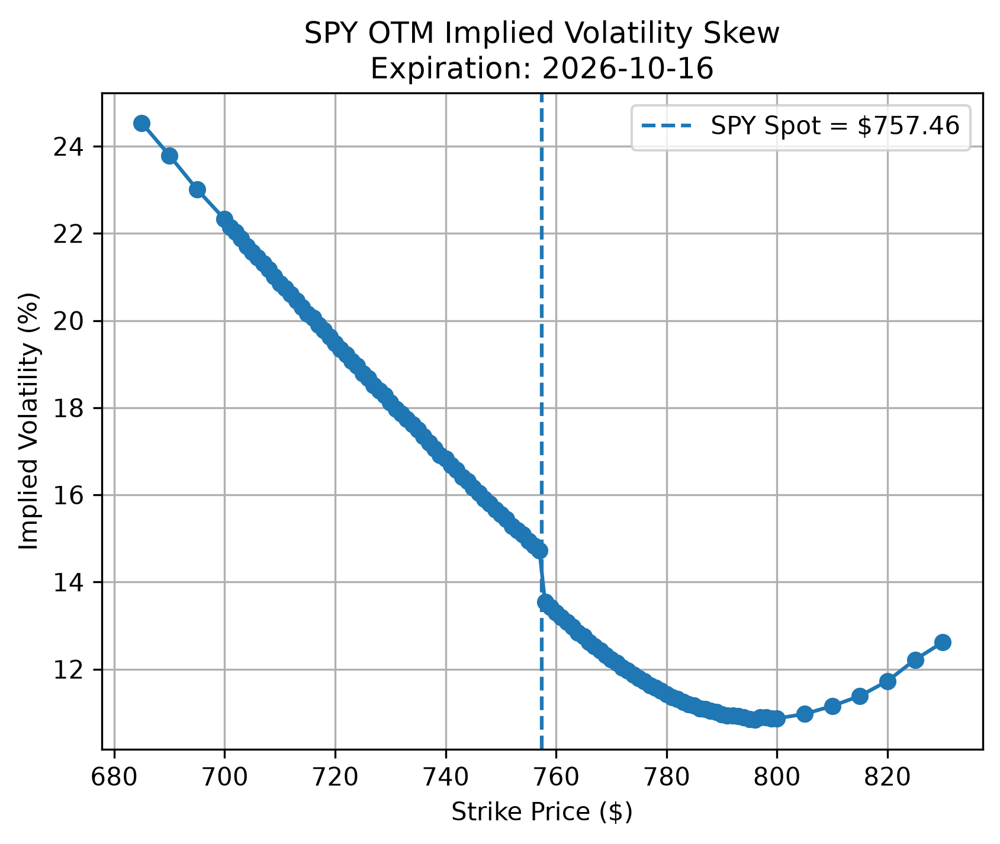

# Options Pricing & Quantitative Finance Project

## Overview

This project implements and compares several option pricing methods in Python, including Black-Scholes, Monte Carlo simulation, and the binomial tree model.

The project also analyzes option Greeks, numerical convergence, computational accuracy, implied volatility, and real SPY option-chain data.

## Objectives

The goals of this project are to:

- Implement the Black-Scholes option pricing model
- Price European call and put options
- Build a Monte Carlo simulation model
- Build a binomial option pricing model
- Compare numerical pricing methods with Black-Scholes
- Analyze convergence and pricing error
- Measure computational runtime
- Calculate option Greeks
- Study option sensitivity to stock price, volatility, and time
- Estimate implied volatility from observed market prices
- Analyze real SPY option-chain data
- Construct an implied volatility skew using OTM options

## Pricing Models

### Black-Scholes

The project implements the closed-form Black-Scholes model for European call and put options.

Inputs include:

- Stock price
- Strike price
- Time to expiration
- Risk-free interest rate
- Volatility

A dividend-adjusted version is also implemented for SPY.

### Monte Carlo Simulation

Stock prices are simulated using geometric Brownian motion.

The estimated option value is calculated as the discounted average payoff across simulated terminal stock prices.

Monte Carlo pricing is compared against the Black-Scholes analytical benchmark.

### Binomial Tree

A Cox-Ross-Rubinstein-style binomial model is implemented by dividing the option's life into discrete time steps and recursively discounting expected option values.

## Convergence Analysis

### Monte Carlo Convergence



Monte Carlo simulations were evaluated across increasing simulation counts.

Repeated trials were used to estimate average absolute pricing error relative to the Black-Scholes benchmark.

### Binomial Convergence



The binomial model was evaluated across increasing numbers of tree steps to measure how numerical accuracy changes as the tree becomes finer.

### Model Convergence Comparison



The results demonstrate that both numerical methods converge toward the analytical Black-Scholes price as computational resolution increases.

## Runtime Analysis

Pricing error was compared with computational runtime for both Monte Carlo and binomial methods.



This provides a practical comparison of pricing accuracy and computational cost.

## Option Greeks

The following Greeks were calculated:

- Delta
- Gamma
- Vega
- Theta
- Rho

### Delta Sensitivity



### Gamma Sensitivity



Sensitivity analysis was also performed with respect to stock price, volatility, and time to expiration.

## Implied Volatility

A numerical implied-volatility solver was developed using binary search.

The solver works backward from an observed market option price to determine the volatility that reproduces that price under the Black-Scholes framework.

## SPY Market Data

Real SPY option-chain data is retrieved using the `yfinance` Python library.

The analysis incorporates:

- Real option bid and ask prices
- SPY spot price
- Dividend yield
- Option expiration dates
- Strike prices

Implied volatility is calculated using midpoint option prices.

## Volatility Skew

### SPY OTM Implied Volatility Skew



To reduce distortions associated with deep in-the-money contracts, the volatility curve uses:

- Out-of-the-money puts below the SPY spot price
- Out-of-the-money calls above the SPY spot price

The resulting volatility skew demonstrates substantially higher implied volatility for downside strikes.

## Key Findings

- Monte Carlo pricing converged toward the analytical Black-Scholes benchmark as the number of simulations increased.
- Repeated Monte Carlo trials reduced the influence of random sampling variation and produced a clearer convergence pattern.
- The binomial tree model converged toward the Black-Scholes price as the number of tree steps increased.
- Delta increased as the call option moved further in-the-money, while Gamma was highest near the at-the-money region.
- Option values increased with volatility and time to expiration.
- A custom binary-search solver successfully estimated implied volatility from observed option prices.
- Real SPY option-chain data exhibited a pronounced downside volatility skew.
- Using OTM puts below spot and OTM calls above spot reduced distortions associated with deep in-the-money option quotes.

## Technologies

- Python
- Matplotlib
- pandas
- yfinance
- `statistics`
- `math`

## Project Structure

```text
options_pricing_project/
├── README.md
├── requirements.txt
├── .gitignore
├── main.py
├── black_scholes.py
├── monte_carlo.py
├── binomial.py
├── implied_volatility.py
├── convergence.py
├── binomial_convergence.py
├── model_comparison.py
├── runtime_comparison.py
├── greeks_plot.py
├── sensitivity_analysis.py
├── market_data.py
├── volatility_smile.py
├── iv_validation.py
├── otm_volatility_skew.py
│
├── data/
│   └── spy_otm_volatility_skew_data.csv
│
└── figures/
    ├── monte_carlo_convergence.png
    ├── binomial_convergence.png
    ├── model_convergence_comparison.png
    ├── runtime_accuracy_comparison.png
    ├── call_price_vs_stock.png
    ├── call_delta_vs_stock.png
    ├── gamma_vs_stock.png
    ├── call_price_vs_volatility.png
    ├── call_price_vs_time.png
    ├── iv_validation.png
    ├── spy_volatility_smile.png
    └── spy_otm_volatility_skew.png
